# Inkvestor — Crowdfunding for Authours
A minimal crowdfunding frontend built with React that talks to a Django REST Framework API.

## Checklist:
### 1:

- [x] Be separated into two distinct projects: an API built using the Django Rest Framework and a website built using React.

        For front end use this link
    [https://inkvestor2.netlify.app/]

        For backend use below link
    [https://inkvestor-40ee966b1650.herokuapp.com]

### 2:

- [x]  Have a cool name, bonus points if it includes a pun and/or missing vowels. See https://namelix.com/ for inspiration. (Bonus Points are meaningless)

        see above 

### 3:

 - [x] Have a clear target audience.
  
        This platform is for aspiring authors and writers who want to publish their books but lack the funds to do so. It also serves book lovers, supporters, and patrons who are interested in backing creative literary projects and helping new voices reach readers.

### 4:

 - [x] Have user accounts. A user should have at least the following attributes:
   - [x] Username
   - [x] Email
   - [x] Password

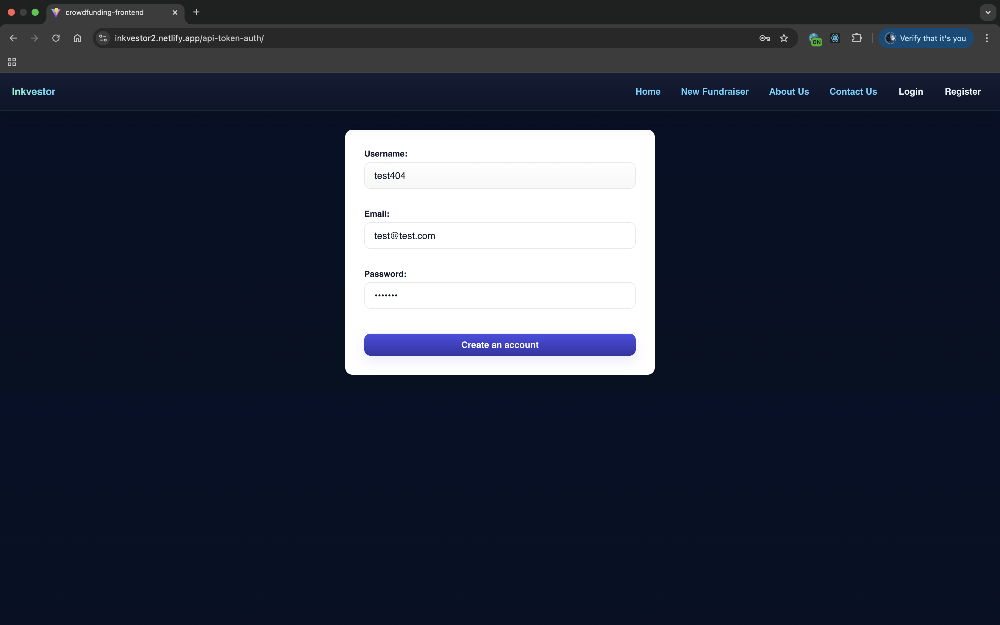

### 5:

 - [x] Ability to create a “fundraiser” to be crowdfunded which will include at least the following attributes:
   - [x] Title
   - [x] Owner (a user)
   - [x] Description
   - [x] Target amount to raise
   - [x] Whether it is currently open to accepting new supporters or not
   - [x] When the fundraiser was created

When creating a new Fundraiser, you need to be logged in. 
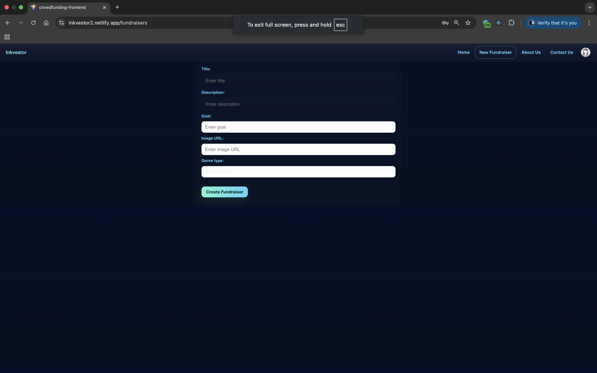

After you created, you will see owner, status, whether it is open or not and when it is created. 

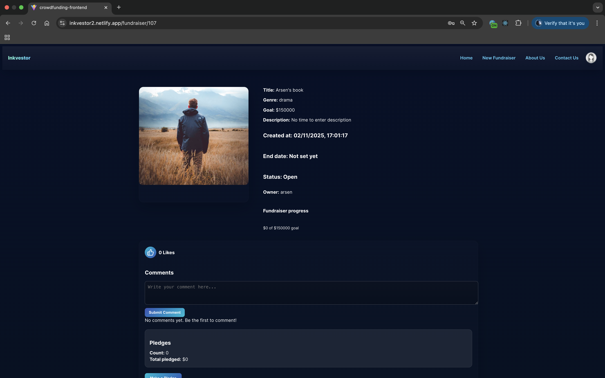

### 6:

 - [x] Ability to “pledge” to a fundraiser. A pledge should include at least the following attributes:
   - [x] Amount
   - [x] The fundraiser the pledge is for
   - [x] The supporter/user (i.e. who created the pledge)
   - [x] Whether the pledge is anonymous or not
   - [x] A comment to go along with the pledge

When you are making a pledge it asks amount, you already pick the fundraiser, it asks whether you want to be anonymous or not, and you can comment.
    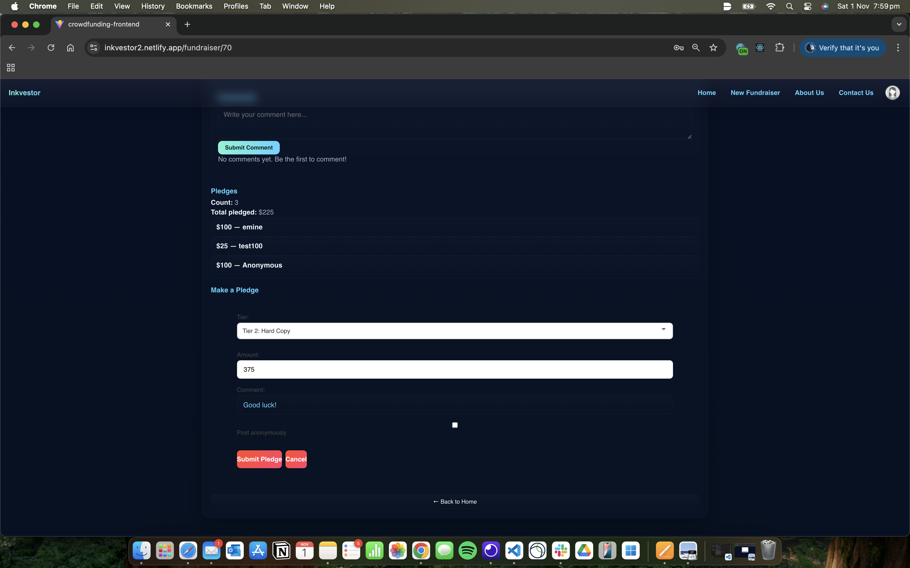

### 7:

 - [x] Implement suitable update/delete functionality, e.g. should a fundraiser owner be allowed to update its description?

    Logged in user is arsen and fundraiser is created by apple, so update or delete button doesnt show up at all. 
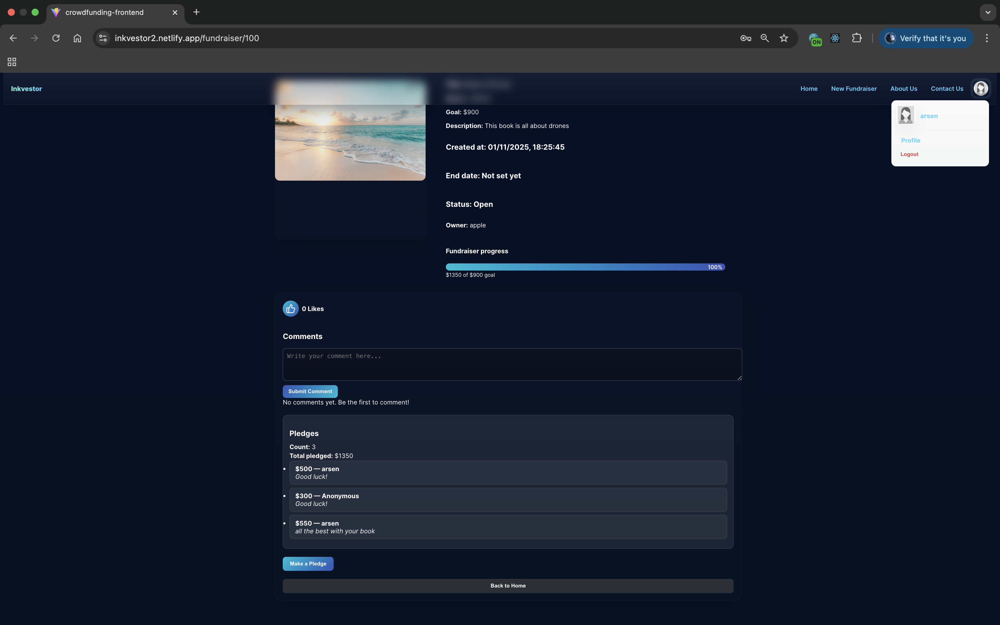

    You can update your own fundraiser. You see update and delete button
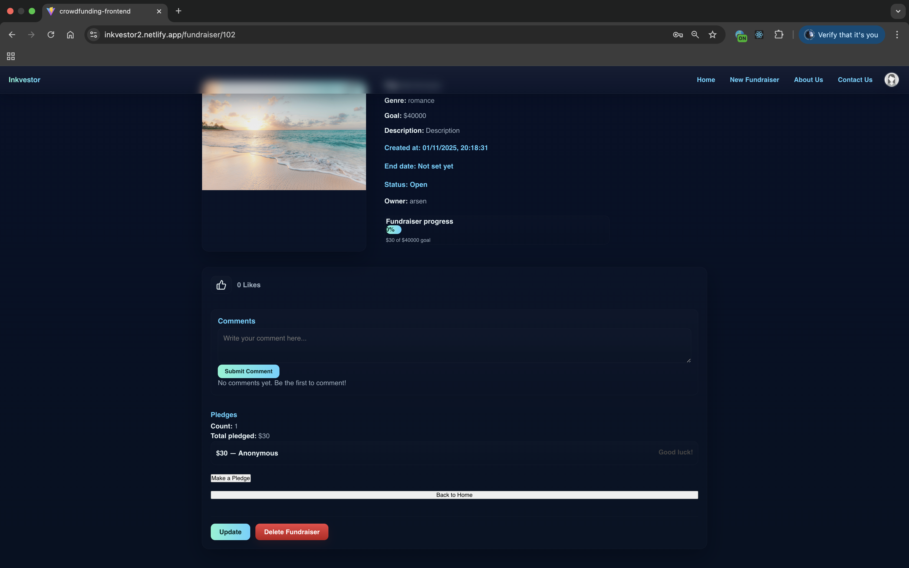

    you can type whatever you want to update to.You can change title, goal, description, url etc.

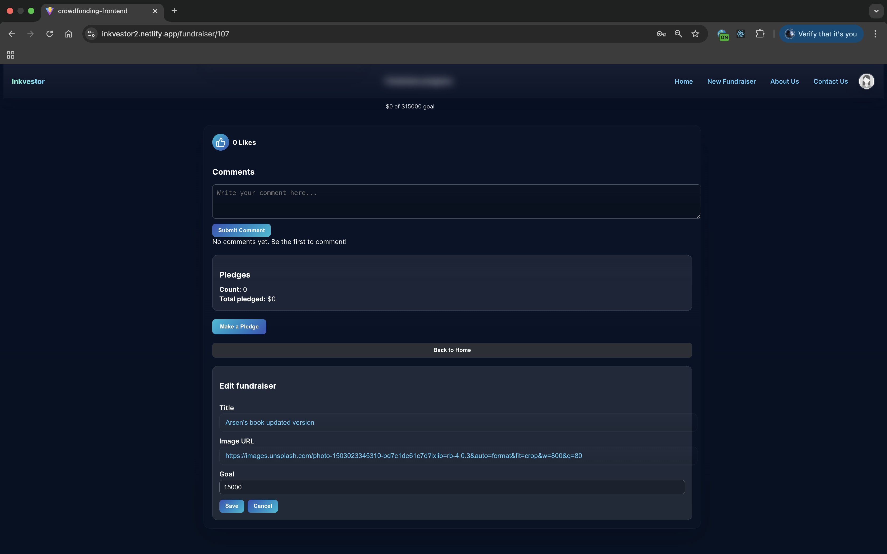
    This is what it looks like after update
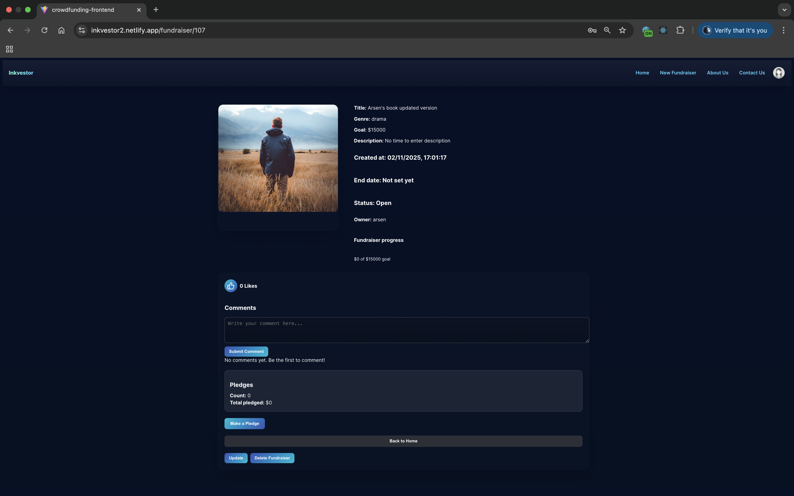

### 8:

 - [x] Implement suitable permissions, e.g. who is allowed to delete a pledge?

        Pledges cannot be deleted.However, to delete or update fundraiser, only owner can do it. See above for refecences. 

### 9:

 - [x] Return the relevant status codes for both successful and unsuccessful requests to the API.

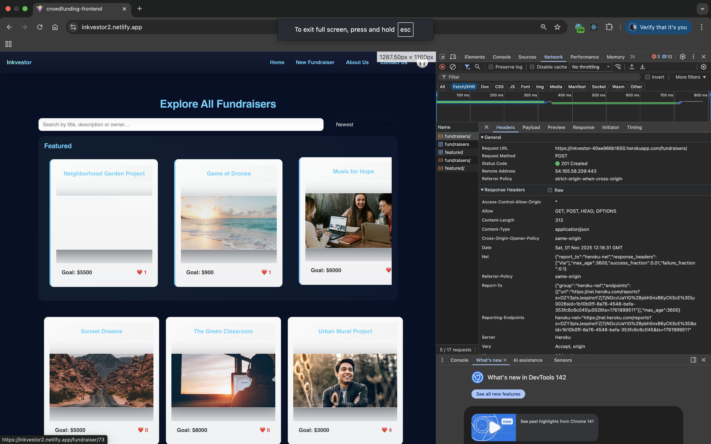

### 10:

 - [x] Handle failed requests gracefully (e.g. you should have a custom 404 page rather than the default error page).

As there is no logged in user, it doesnt allow to create fundriaser. ( screenshot is taken before css update)
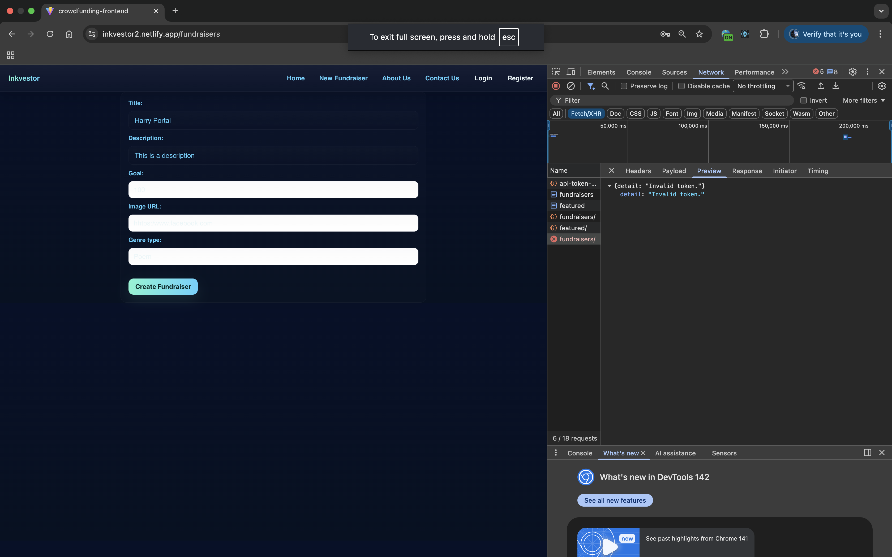

You are not allowed to pledge against your own. 
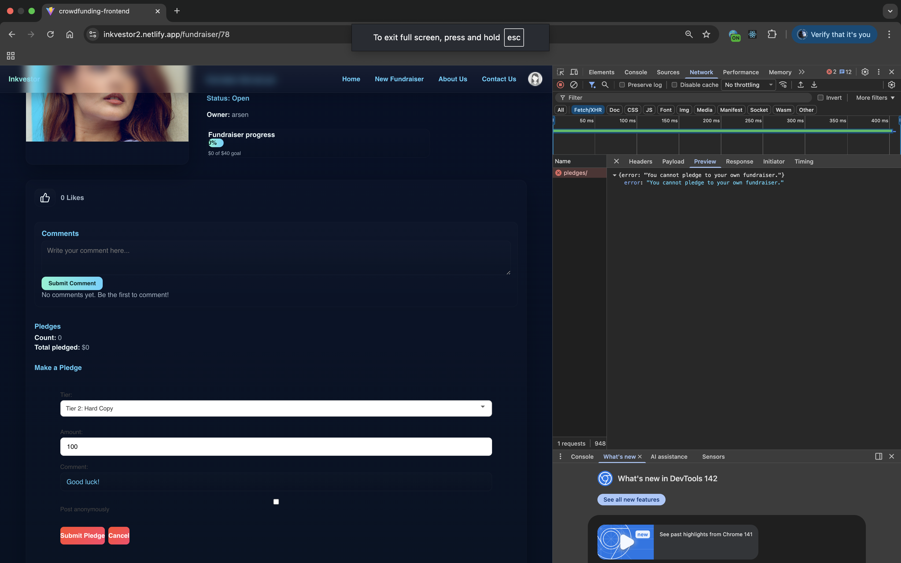

### 11:

 - [x] Use Token Authentication, including an endpoint to obtain a token along with the current user's details.

        Token will be diaplay in the network.

 - [x] Implement responsive design.

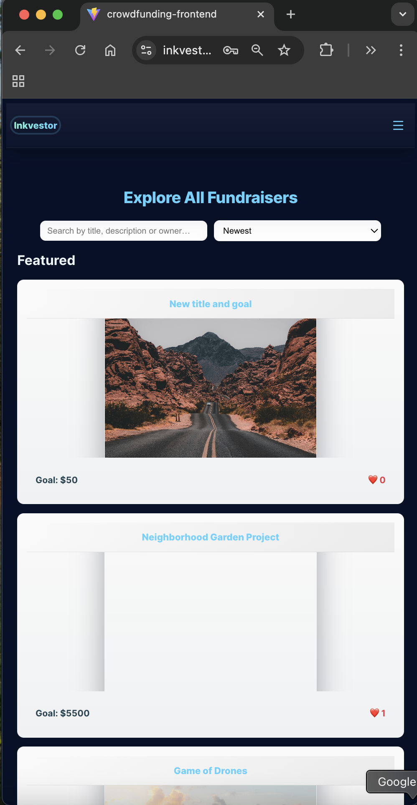

hamburger menu 
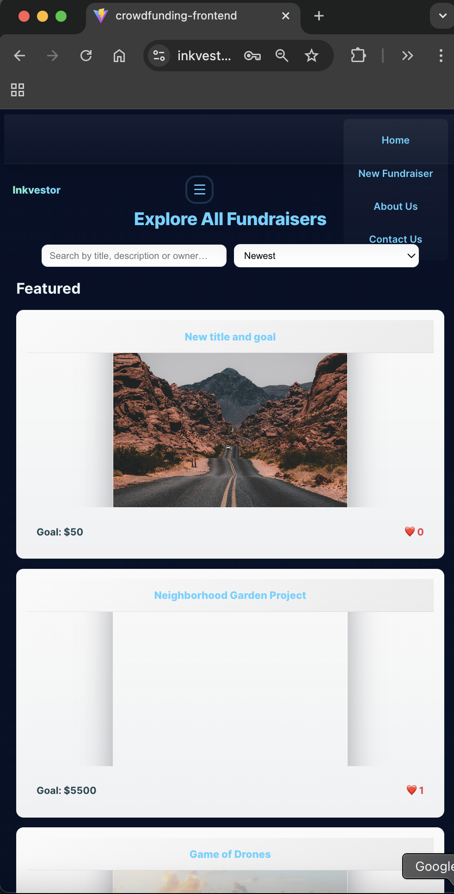

responsive design
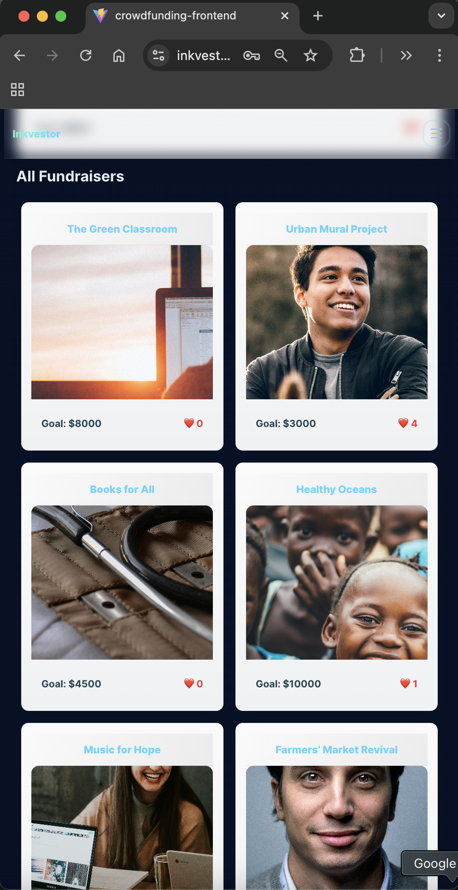

responsive design
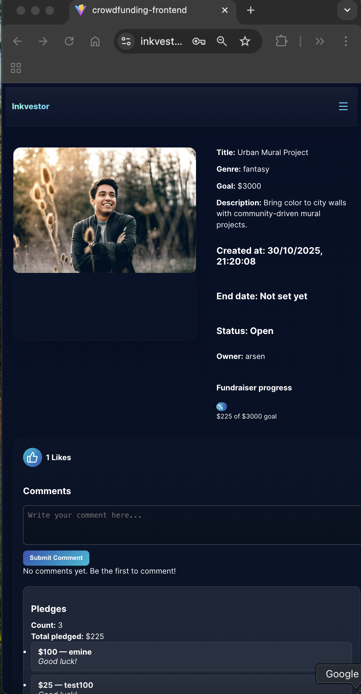

responsive design
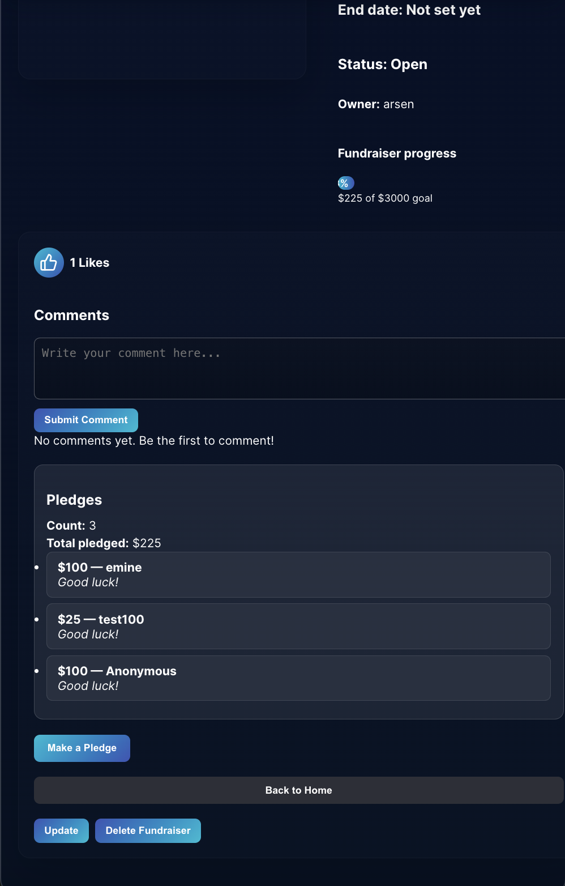

#### Extra features 

Sort by and search bar
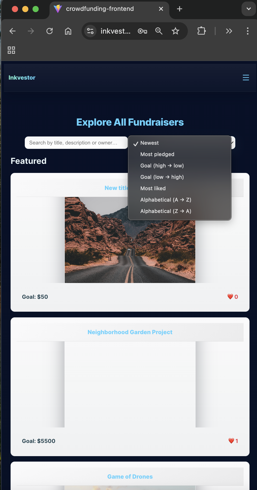

comment on fundraiser
